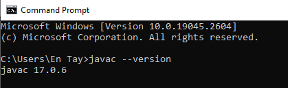

# Instalasi dan Setup
Berikut beberapa program yang perlu dipersiapkan yang akan digunakan dalam perkuliahan.

## Download
- [JDK](https://www.oracle.com/id/java/technologies/downloads/)
- [Netbean](https://netbeans.apache.org/download/index.html) / [Visual Studio Code](https://code.visualstudio.com/download)
- [Github Desktop](https://desktop.github.com/)

## Online Service
- Online Compiler:
  - https://www.programiz.com/java-programming/online-compiler/
  - https://www.online-java.com/
  - https://www.tutorialspoint.com/online_java_compiler.php
- [Github](https://github.com): Buat akun github untuk pengiriman tugas.

## Menjalankan Program Java Pertama Anda

Kita akan coba membuat dan menjalankan program _Java_ pertama kita. Untuk itu, buat program berikut, simpan dengan nama file `HelloWorld.java`. Untuk program sederhana, disarankan menggunakan editor _Notepad++_.

```java
class HelloWorld {
    public static void main(String[] args) {
        System.out.println("Hello, World!"); 
    }
}
```

Program _Java_ ini akan dijalankan lewat _command prompt_. Dengan demikian buka _command prompt_ dan pastikan komputer Anda sudah bisa menjalankan program java, gunakan perintah `javac --version`. Versi _Java_ akan muncul sebagai output jika _Java Runtime_ sudah terpasang dengan benar pada komputer Anda.



Berikutnya, set folder aktif, ke lokasi folder dimana file `HelloWorld.java` disimpan (contoh: `C:\latihan`).
Sebelum program ini bisa dijakankan, ia perlu di-_compile_ terlebih dahulu. Untuk melakukan _compile_ gunakan perintah `javac HelloWorld.java`. Perintah ini akan menghasilkan file _byte code_ `HelloWorld.class`, dan untuk menjalankan file program hasil _compile_, gunakan perintah `java HelloWorld`.

```
C:\latihan>javac HelloWorld.java

C:\latihan>java HelloWorld
Hello, World!

```

## Menggunakan Visual Studio Code (VSC)

Kita bisa menggunakan VSC untuk membuat program Java sederhana. Ikuti langkah berikut:

1. Buka VSC
2. Buat/buka folder kerja
3. Buat file baru, simpan dengan nama `HelloWorld.java` (kode copy-paste dari contoh program di atas)
4. Jalankan program dengan menekan tombol `F5`
   