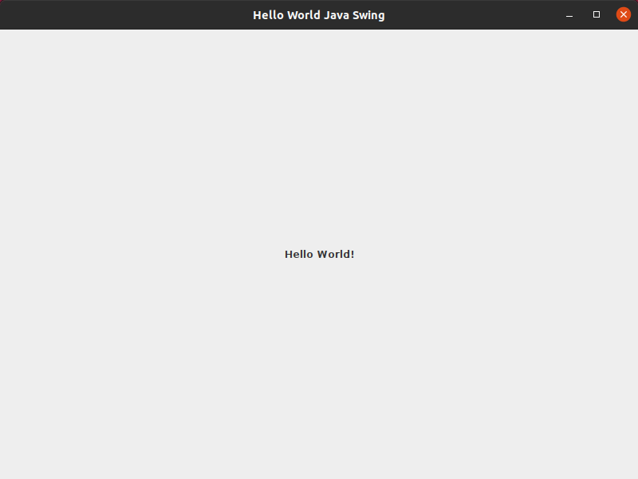

Kerjakan latihan dengan mengikuti langkah-langkah berikut:

## 1. Buat Project

👉 Buka **NetBeans IDE**.
    
👉  Klik menu **File** > **New Project...** (atau tekan `Ctrl + Shift + N`).

🔹 Pilih kategori _Java with Ant_, lalu pilih **Java Application**. Klik **Next**.

🔹  Beri nama project Anda, misalnya `HelloWorld`.

🔹 Tentukan lokasi penyimpanan, lalu klik **Finish**.

## 2. Buat JFrame / Form Baru

👉 Di panel **Projects** (sebelah kiri), buka folder project `HelloWorld` > **Source Packages**.
    
👉 Klik kanan pada package yang ada (atau buat package baru), pilih **New** > **JFrame Form...**
    
👉 Beri nama class-nya, misalnya `FormUtama`.
    
👉 Klik **Finish**. NetBeans akan membuka design editor secara otomatis.

## 3. Buat JLabel

Setelah langkah di atas, Anda akan melihat sebuah kotak kosong (JFrame) dan panel **Palette** di sebelah kanan.

👉 Cari komponen **Label** di panel **Palette** (biasanya di bawah kategori _Swing Controls_).
    
👉  Klik dan tarik (_drag & drop_) komponen **Label** tersebut ke dalam kotak JFrame kosong Anda.
    
👉  Klik kanan pada label yang baru Anda masukkan, lalu pilih **Edit Text**.
    
👉  Ubah teksnya menjadi **"Hello World"**.
    
💡  _(Opsional)_ Anda bisa mengubah ukuran font di panel **Properties** sebelah kanan pada bagian `font` agar tulisannya terlihat lebih besar.

## 4. Coding untuk menampilkan JFrame

👉 Klik kanan di area kosong pada design editor `FormUtama.java`.
    
👉  Pilih **Run File** (atau tekan `Shift + F6`).
    
👉  Window kecil akan muncul di layar komputer Anda dengan tulisan "Hello World".
    

> 💡 Jika Anda ingin project ini langsung berjalan saat mengklik tombol _Play_ (Run Project) di bagian atas NetBeans, klik kanan pada nama project utama > **Properties** > **Run** > lalu pilih `FormUtama` sebagai **Main Class**-nya.

## Contoh Output

