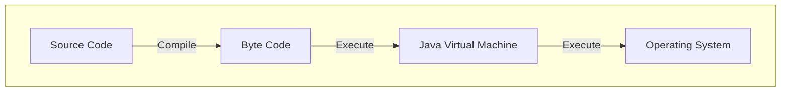

# Mengenal Java

Referensi:
- [Petani Kode: Pengenalan Java untuk Pemula](https://www.petanikode.com/java-untuk-pemula/)
- [Petani Kode: Konsep Pemrograman Java yang perlu dipahami](https://www.petanikode.com/java-konsep/)
