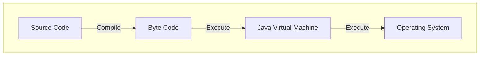

# Mengenal Java

```mermaid
flowchart TD
subgraph Z[" "]
    direction LR
    A[Source Code] -->|Compile| B[Byte Code]
    B --> |Execute| C[Java Virtual Machine]
    C --> |Execute| D[Operating System]
end
```